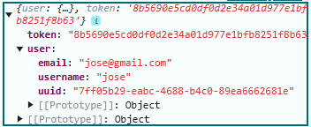

# Pasos para correr el servidor con Docker

## Abrir docker desktop
Para que arranquen los servicios de docker y usen la terminal

## Clonar este repositorio y el de frontend

## Construir y levantar los contenedores
1) Abran una terminal en el directorio del frontend
2) escriban el comando `docker compose up`
3) Hacer lo mismo en el directorio del backend

# API Documentation
Tenemos una carpeta llamada _services_ la cual deberán utilizar para hacer peticiones HTTP a nuestro servidor de Django REST Framework. Actualmente cuenta con dos archivos: `registerService.js` y `utils.js`.
## services/utils.js
Este archivo cuenta con varias funciones asíncronas para poder importar en otros archivos, se deben de importar una a una usando la [sintaxis de desestructuración](https://www.digitalocean.com/community/tutorials/understanding-destructuring-rest-parameters-and-spread-syntax-in-javascript-es) para importarlos. Sólo utilizamos el de post y get.

No tienen que interactuar con este archivo.

## services/registerService.js
Este es el servicio para hacer las peticiones HTTP a nuestro servidor, utiliza Axios para hacer las consultas. Este archivo, como los demás que proximamente estarán en esta carpeta con sufijo _Service_ SÍ tienen que utilizar e interactuar con ellos.

Tienen que crear un objeto json para estructurar el paquete de datos a enviar, las llaves en los objetos no son arbitrarias, deben de ser siempre las que va a leer el backend. Por ejemplo, para el login, el backend lee el valor de _email_ y _password_. Chequen el código del backend para saber qué llaves utilizar. Este es un ejemplo de cómo mandar la petición:

```javascript
const data = {
    password: password,
    email: email,
}

const response = await registerService.login(data);
```

## lib/authSession.js
Los datos de sesión del usuario se guardan en una cookie, este archivo contiene varias funcionas para importarse en cualquier otro archivo donde estén trabajando.

### getSession()
Esta es la función más importante y que van a estar usando para casos como:
* Validar si tiene sesión iniciada
* Recuperar información de sesión

La información de sesión es la siguiente actualmente:


Para recuperar el token (*importante para poder hacer las peticiones al servidor con el token de sesión*) pueden sacarlo de esta manera:
```javascript
const auth = getSession();

console.log(auth.token)

```

Para recuperar algún dato del usuario, tal como _email_, _username_, _uuid_:

```javascript
const auth = getSession();

console.log(auth.user.email)
console.log(auth.user.username)
console.log(auth.user.uuid)

```

Es así como pueden sacar estos datos de la cookie para mandar peticiones HTTP a nuestro servidor

### SESSION_COOKIE_NAME
Esta es una constante que guarda el nombre de la cookie, ese valor no lo toquen.

### saveSession(sessionObject)
Esto guarda un objeto json en la cookie

### deleteSession()
Esta función elimina los datos de sesión de la cookie, se usa para cerrar sesión, cosa que ya está implementada.


